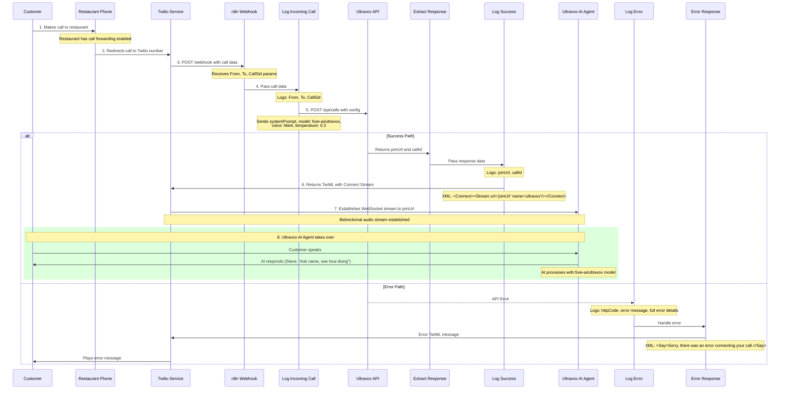
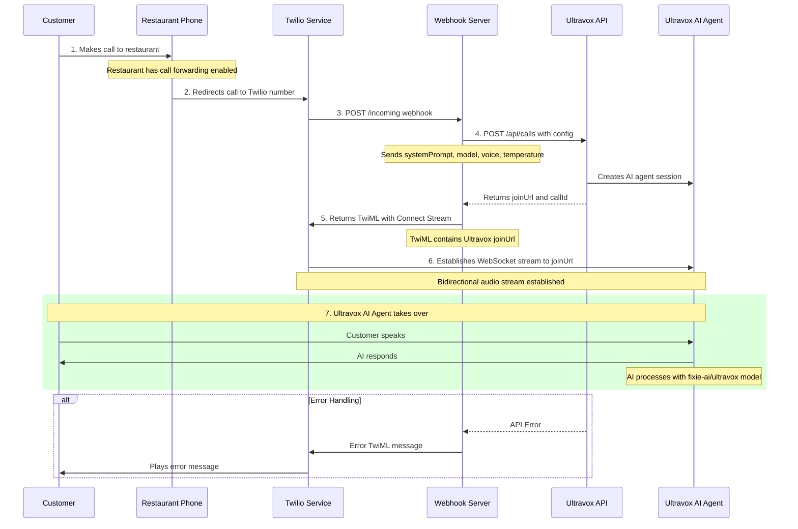
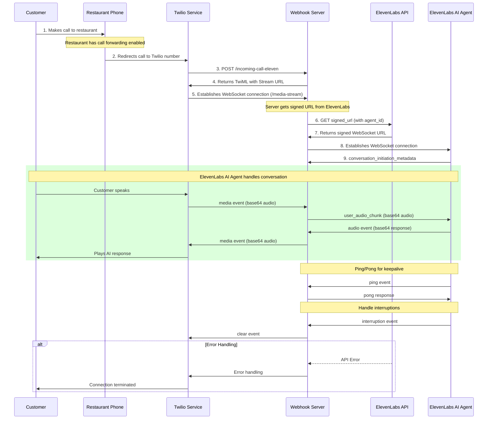
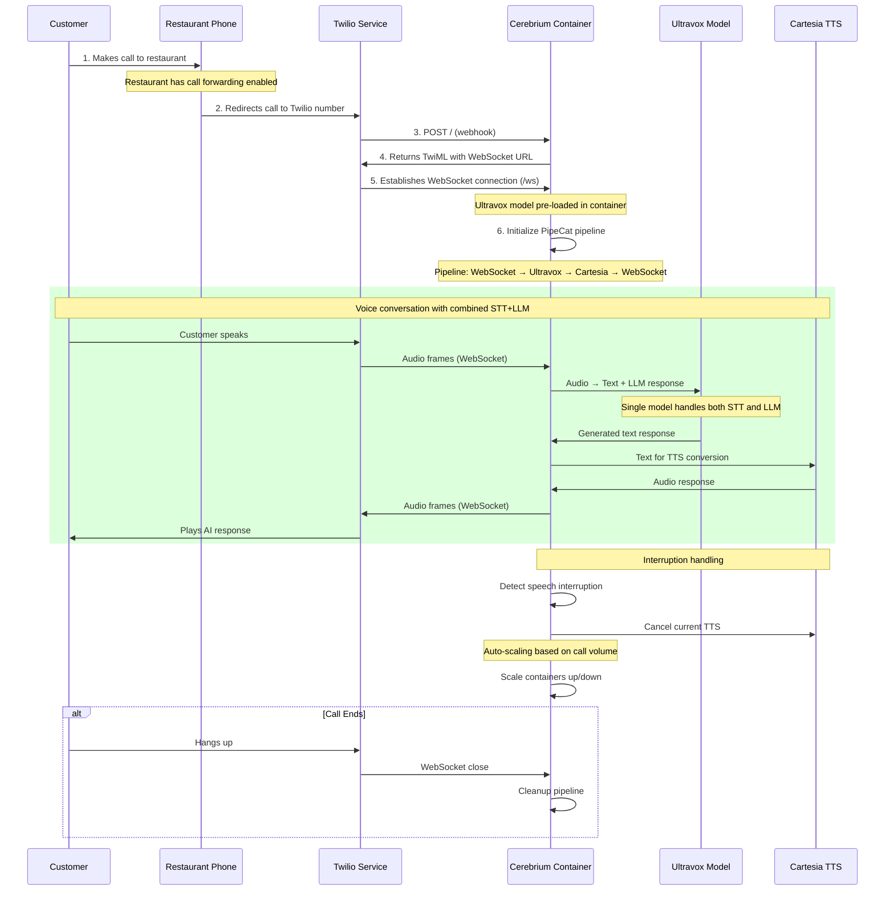

# Voice Agents

## General Notes

- The goal of this repository is to try out the component technologies of voice agents and see how they fit together
  - Twilio (required)
  - Ultravox or ElevenLabs 
  - n8n/JSON, versus Express.js/Javascript, versus FastAPI/Python
  - Ultravox.ai versus Ultravox self-hosted
 
- Conclusions
  - Use Twilio with either ElevenLabs or Ultravox.ai (non self-hosted Ultravox)
  - Probably prefer Express.js/Typescript over n8n/JSON or FastAPI/Python as the webhook server
  - This would be easier to integrate into a SASS application using the [Open SASS](https://docs.opensaas.sh/) template
 
### Advantages of Voice Agents over Standard IVR


 
### Standard Voice Agent Architecture


Standard: Audio-IN ->> ASR/STT ->> LLM ->> TTS ->> Audio OUT

Ultravox: Audio-IN ->> Ultravox ->> TTS ->> Audio OUT
 
### Ultravox Architecture

Ultravox is a multimodal LLM that understands text and human speech without separate ASR. It converts audio to LLM’s high-dimensional space, responding faster than systems with separate ASR and LLM components.

[](https://docs.google.com/presentation/d/1ey81xuuMzrJaBwztb_Rq24Cit37GQokD2aAes_KkGVI/edit)

[Ultravox Architecture](https://github.com/fixie-ai/ultravox/blob/main/README.md)


## The Twilio/Ultravox Setup

The Webhook Server could be one of...

- n8n Workflow webhook server [JSON](twilio_ultravox/n8n) (see notes at end on [scaling n8n](https://github.com/Astrotope/voice-agents/blob/main/README.md#-n8n))
- Express/Node server (node.js) [Javascript/Typescript](twilio_ultravox/javascript)
- FastAPI/Uvicorn server [Python](twilio_ultravox/python)

The Webhook Server is middleware that connects the Twilio Stream to the Ultravox Agent.

Once connected the Ultravox Agent takes over.

I've worked through 6 possible set-ups. 
I'm still waiting for regulatory bundle approval with Twilio, before I can test the code.

- Twilio/Ultravox Process (n8n Webhook Server) [Sequence Diagram](https://github.com/Astrotope/voice-agents/blob/main/README.md#twilioultravox-process-n8n-webhook-server), [Code](twilio_ultravox/n8n)
- Twilio/Ultravox Process (Express.js Webhook Server) [Sequence Diagram](https://github.com/Astrotope/voice-agents/blob/main/README.md#twilioultravox-process-expressjs-or-fastapi-webhook-server), [Code](twilio_ultravox/javascript)
- Twilio/Ultravox Process (FastAPI Webhook Server) [Sequence Diagram](https://github.com/Astrotope/voice-agents/blob/main/README.md#twilioultravox-process-expressjs-or-fastapi-webhook-server), [Code](twilio_ultravox/python)
- Twilio/ElevenLabs Process (Express.js Webhook Server) [Sequence Diagram](https://github.com/Astrotope/voice-agents/blob/main/README.md#twilioelevenlabs-process), [Code](twilio_elevenlabs/javascript)
- Twilio/Ultravox/Cartesia/Cerebrium Process (Python Webhook Server) [Sequence Diagram](https://github.com/Astrotope/voice-agents/blob/main/README.md#twilioultravoxcartesiacerebrium-process), [Code](twilio_ultravox_cerebrium/v1)
  - This is a future option for self-hosting Ultravox
    - It would require a moderate customer base to make it viable
  - Pay-as-you-go serverless GPU service
    - Can run GPU's during business or busy hours
    - Start-up is estimated at 40 seconds
    - This would need some careful thought about when to spin-up GPU's

## Twilio/Ultravox Process (n8n Webhook Server)

See code ... [Twiliod Ultravox n8n v1](twilio_ultravox/n8n)

See code ... [Twiliod Ultravox n8n v2](twilio_ultravox/n8n/v2)

Sequence Diagram



## Twilio/Ultravox Process (Express.js or FastAPI Webhook Server)

See code ... [Twiliod Ultravox n8n Javascript](twilio_ultravox/javascript)

See code ... [Twiliod Ultravox n8n Python](twilio_ultravox/python)

Sequence Diagram



## Twilio/ElevenLabs Process

See code ... [Twiliod ElevenLabs Javascript](twilio_elevenlabs/javascript)

Sequence Diagram



## Twilio/Ultravox/Cartesia/Cerebrium Process

### Self-hosting Ultravox (STT/LLM) with Cartesia (TTS) on Cerebrium (Pay-as-you-go GPU's)

See code ... [Twiliod Ultravox Cartesia Cerebrium Python v1](twilio_ultravox_cerebrium/v1)

See code ... [Twiliod Ultravox Cartesia Cerebrium Python v2](twilio_ultravox_cerebrium/v2)

Sequence Diagram




## Glossary

- **PSTN** - Public Switched Telephone Network
- **Webhook** - User-defined HTTP callbacks. Webhooks to let your application know when events happen. Webhooks make an HTTP request (usually a POST 	or GET) to the URL you configured for the webhook.


## Research

---

### >> [Twilio](https://www.twilio.com/)

[New Zealand Pricing](https://www.twilio.com/en-us/voice/pricing/nz)

- Clean Local Number - $3.15 / mo
- Receive Calls - Local - $0.0100 / min +$3.15 / mo

[Python SDK](https://www.twilio.com/docs/voice/quickstart/python)

[Respond to Incoming Calls](https://www.twilio.com/docs/voice/quickstart/python#respond-to-incoming-calls-with-twilio)

[Configure Webhook URL](https://www.twilio.com/docs/voice/quickstart/python#respond-to-incoming-calls-with-twilio)

[Secure Connections to Twilio](https://www.twilio.com/docs/usage/securityhttps://www.twilio.com/docs/usage/security)

[Python SDK](https://github.com/twilio/twilio-python)

Reduce NZ call handling latency by moving inbound processing region to AU1 from US1

[Set a phone number's inbound processing Region using the Console](https://www.twilio.com/docs/global-infrastructure/inbound-processing-console)


---

### >> [Ultravox Open Source Model - Hugging Face](https://huggingface.co/fixie-ai/models)

May 7, 2025 - v0.5 70b - [fixie-ai/ultravox-v0_5-llama-3_3-70b](https://huggingface.co/fixie-ai/ultravox-v0_5-llama-3_3-70b)

Ultravox is a multimodal Speech LLM built around a pretrained Llama3.3-70B-Instruct and whisper-large-v3-turbo backbone.

- No Ultravox API/SDK
- No TTS system built-in. BYO TTS
- Requires A100 80GB to run (about USD $1.1/hr https://cloud.vast.ai/ or https://vm.massedcompute.com/)
- Need to agree to Meta Llama license

---

### >> [Ultravox.ai](https://www.ultravox.ai/)

#### Python/FastAPI/httpx - Basic (Converted with Claude)

[Twilio Python SDK](https://www.twilio.com/docs/libraries/reference/twilio-python/)
[Ultravox REST API](https://docs.ultravox.ai/api-reference/introduction)

```python
import os
import asyncio
from typing import Optional
from fastapi import FastAPI, Request, HTTPException
from fastapi.responses import Response
import httpx
from twilio.twiml.voice_response import VoiceResponse
import logging

# Configure logging
logging.basicConfig(level=logging.INFO)
logger = logging.getLogger(__name__)

app = FastAPI(title="Ultravox FastAPI Server")

# Configuration
ULTRAVOX_API_KEY = os.getenv('ULTRAVOX_API_KEY')
ULTRAVOX_API_URL = 'https://api.ultravox.ai/api/calls'

if not ULTRAVOX_API_KEY:
    raise ValueError("ULTRAVOX_API_KEY environment variable is required")

# Ultravox configuration
SYSTEM_PROMPT = 'Your name is Steve. You are receiving a phone call. Ask them their name and see how they are doing.'

ULTRAVOX_CALL_CONFIG = {
    "systemPrompt": SYSTEM_PROMPT,
    "model": "fixie-ai/ultravox",
    "voice": "Mark",
    "temperature": 0.3,
    "firstSpeaker": "FIRST_SPEAKER_AGENT",
    "medium": {"twilio": {}}
}

async def create_ultravox_call() -> dict:
    """Create Ultravox call and get join URL"""
    async with httpx.AsyncClient() as client:
        try:
            response = await client.post(
                ULTRAVOX_API_URL,
                json=ULTRAVOX_CALL_CONFIG,
                headers={
                    'Content-Type': 'application/json',
                    'X-API-Key': ULTRAVOX_API_KEY
                },
                timeout=30.0
            )
            response.raise_for_status()
            return response.json()
        except httpx.HTTPStatusError as e:
            logger.error(f"HTTP error calling Ultravox API: {e.response.status_code} - {e.response.text}")
            raise HTTPException(
                status_code=502,
                detail=f"Ultravox API error: {e.response.status_code}"
            )
        except httpx.RequestError as e:
            logger.error(f"Request error calling Ultravox API: {e}")
            raise HTTPException(
                status_code=502,
                detail="Failed to connect to Ultravox API"
            )

@app.post("/incoming")
async def handle_incoming_call(request: Request):
    """Handle incoming calls from Twilio"""
    try:
        logger.info("Incoming call received")
        
        # Create Ultravox call
        ultravox_response = await create_ultravox_call()
        
        # Generate TwiML response
        twiml = VoiceResponse()
        connect = twiml.connect()
        connect.stream(
            url=ultravox_response['joinUrl'],
            name='ultravox'
        )
        
        # Return TwiML as XML
        return Response(
            content=str(twiml),
            media_type="text/xml"
        )
        
    except HTTPException:
        # Re-raise HTTP exceptions (these have proper error responses)
        raise
    except Exception as e:
        logger.error(f"Unexpected error handling incoming call: {e}")
        
        # Return error TwiML
        twiml = VoiceResponse()
        twiml.say('Sorry, there was an error connecting your call.')
        
        return Response(
            content=str(twiml),
            media_type="text/xml"
        )

@app.get("/health")
async def health_check():
    """Health check endpoint"""
    return {"status": "healthy", "service": "Ultravox FastAPI Server"}

if __name__ == "__main__":
    import uvicorn
    uvicorn.run(app, host="0.0.0.0", port=3000)
```

#### Express Server - Typescript/Javascript Basic App

[Ultravox Twilio Incoming Call Quickstart](https://github.com/fixie-ai/ultradox/tree/main/examples/twilio-incoming-quickstart-js)

[Ultravox Docs](https://docs.ultravox.ai/gettingstarted/quickstart-phone-incoming)

[Code Link](https://github.com/fixie-ai/ultradox/blob/main/examples/twilio-incoming-quickstart-js/index.js)

``` javascript
import express from 'express';
import https from 'https';
import twilio from 'twilio';
import 'dotenv/config'

const app = express();
const port = 3000;

// Configuration
const ULTRAVOX_API_KEY = process.env.ULTRAVOX_API_KEY
const ULTRAVOX_API_URL = 'https://api.ultravox.ai/api/calls';

// Ultravox configuration
const SYSTEM_PROMPT = 'Your name is Steve. You are receiving a phone call. Ask them their name and see how they are doing.';

const ULTRAVOX_CALL_CONFIG = {
    systemPrompt: SYSTEM_PROMPT,
    model: 'fixie-ai/ultravox',
    voice: 'Mark',
    temperature: 0.3,
    firstSpeaker: 'FIRST_SPEAKER_AGENT',
    medium: { "twilio": {} }
};

// Create Ultravox call and get join URL
async function createUltravoxCall() {
    const request = https.request(ULTRAVOX_API_URL, {
        method: 'POST',
        headers: {
            'Content-Type': 'application/json',
            'X-API-Key': ULTRAVOX_API_KEY
        }
    });

    return new Promise((resolve, reject) => {
        let data = '';

        request.on('response', (response) => {
            response.on('data', chunk => data += chunk);
            response.on('end', () => resolve(JSON.parse(data)));
        });

        request.on('error', reject);
        request.write(JSON.stringify(ULTRAVOX_CALL_CONFIG));
        request.end();
    });
}

// Handle incoming calls
app.post('/incoming', async (req, res) => {
    try {
        console.log('Incoming call received');
        const response = await createUltravoxCall();
        const twiml = new twilio.twiml.VoiceResponse();
        const connect = twiml.connect();
        connect.stream({
            url: response.joinUrl,
            name: 'ultravox'
        });

        const twimlString = twiml.toString();
        res.type('text/xml');
        res.send(twimlString);

    } catch (error) {
        console.error('Error handling incoming call:', error);
        const twiml = new twilio.twiml.VoiceResponse();
        twiml.say('Sorry, there was an error connecting your call.');
        res.type('text/xml');
        res.send(twiml.toString());
    }
});

// Start server
app.listen(port, () => {
    console.log(`Server running on port ${port}`);
});
```

[Ultravox Twilio Incoming Call Advanced](https://github.com/fixie-ai/ultradox/tree/main/examples/twilio-incoming-advanced-js)

[Youtube Video](https://www.youtube.com/watch?v=sa9uF5Rr9Os)

[Code Link](https://github.com/fixie-ai/ultradox/tree/main/examples/twilio-incoming-advanced-js)

```javascript
import express from 'express';
import twilio from 'twilio';
import 'dotenv/config';
import { createUltravoxCall } from '../ultravox-utils.js';
import { ULTRAVOX_CALL_CONFIG } from '../ultravox-config.js';

const client = twilio(process.env.TWILIO_ACCOUNT_SID, process.env.TWILIO_AUTH_TOKEN);
const destinationNumber = process.env.DESTINATION_PHONE_NUMBER;
const router = express.Router();

// Hack: Dictionary to store Twilio CallSid and Ultravox Call ID mapping
// TODO replace this with something more durable
const activeCalls = new Map();

async function transferActiveCall(ultravoxCallId) {
    try {
        const callData = activeCalls.get(ultravoxCallId);
        if (!callData || !callData.twilioCallSid) {
            throw new Error('Call not found or invalid CallSid');
        }

        // First create a new TwiML to handle the transfer
        const twiml = new twilio.twiml.VoiceResponse();
        twiml.dial().number(destinationNumber);

        // Update the active call with the new TwiML
        const updatedCall = await client.calls(callData.twilioCallSid)
            .update({
                twiml: twiml.toString()
            });

        return {
            status: 'success',
            message: 'Call transfer initiated',
            callDetails: updatedCall
        };

    } catch (error) {
        console.error('Error transferring call:', error);
        throw {
            status: 'error',
            message: 'Failed to transfer call',
            error: error.message
        };
    }
}

// Handle incoming calls from Twilio
router.post('/incoming', async (req, res) => {
    try {
        console.log('Incoming call received');
        const twilioCallSid = req.body.CallSid;
        console.log('Twilio CallSid:', twilioCallSid);

        // Create the Ultravox call
        const response = await createUltravoxCall(ULTRAVOX_CALL_CONFIG);

        activeCalls.set(response.callId, {
            twilioCallSid: twilioCallSid
        });

        const twiml = new twilio.twiml.VoiceResponse();
        const connect = twiml.connect();
        connect.stream({
            url: response.joinUrl,
            name: 'ultravox'
        });

        const twimlString = twiml.toString();
        res.type('text/xml');
        res.send(twimlString);

    } catch (error) {
        console.error('Error handling incoming call:', error);
        const twiml = new twilio.twiml.VoiceResponse();
        twiml.say('Sorry, there was an error connecting your call.');
        res.type('text/xml');
        res.send(twiml.toString());
    }
});

// Handle transfer of calls to another number
router.post('/transferCall', async (req, res) => {
    const { callId } = req.body;
    console.log(`Request to transfer call with callId: ${callId}`);

    try {
        const result = await transferActiveCall(callId);
        res.json(result);
    } catch (error) {
        res.status(500).json(error);
    }
});

router.get('/active-calls', (req, res) => {
    const calls = Array.from(activeCalls.entries()).map(([ultravoxCallId, data]) => ({
        ultravoxCallId,
        ...data
    }));
    res.json(calls);
});

export { router };
```

---

### >> [n8n]()

#### [n8n Scaling - Queue Mode](https://docs.n8n.io/hosting/scaling/queue-mode/)


[How to configure n8n queue mode on VPS?](https://www.hostinger.com/in/tutorials/n8n-queue-mode)

#### n8n Queue Mode Setup


#### n8n Queue Mode Process


#### n8n Webhook Queue Mode Process

[Question on the full N8N stack (main, webhook and worker)](https://community.n8n.io/t/question-on-the-full-n8n-stack-main-webhook-and-worker/16605)


